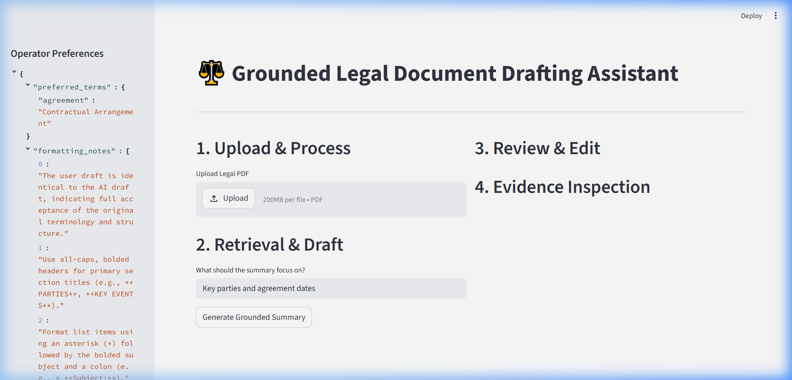
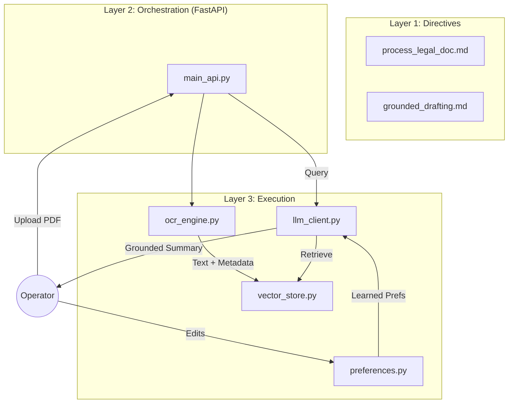
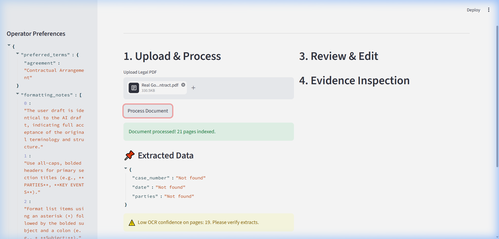
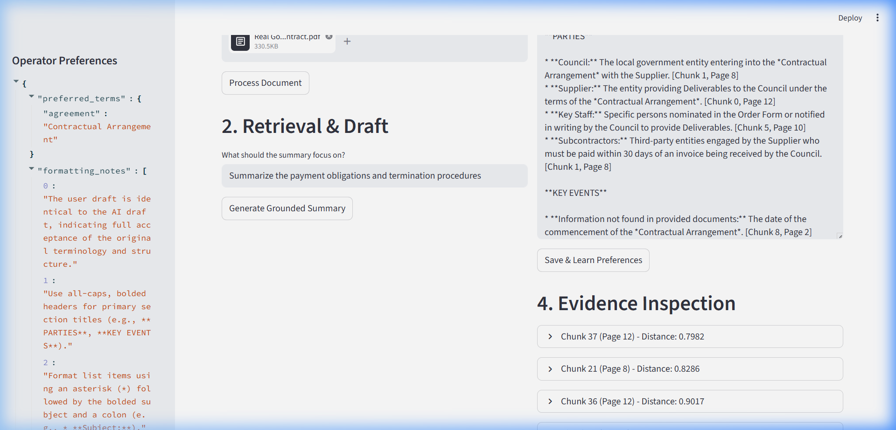
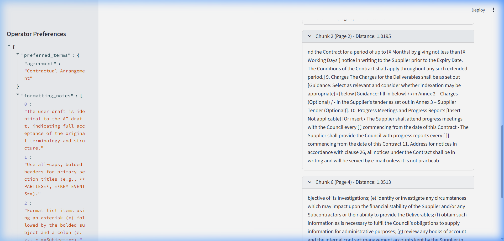
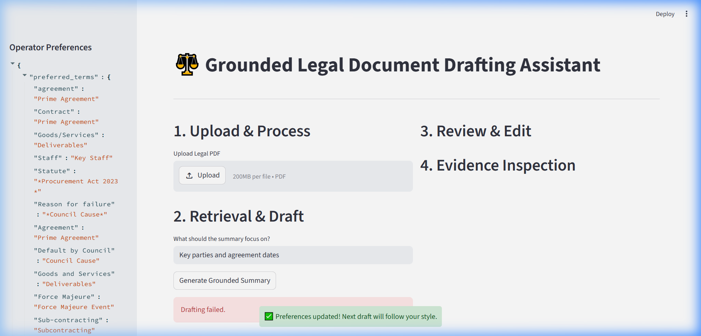

# ⚖️ Grounded Legal Document Drafting Assistant
**Pearson Specter Litt - AI Engineer Assessment**

A robust AI workflow designed to ingest messy legal documents, extract structured information, and generate grounded, cited drafts that learn from operator feedback.

---

## 📽️ Project Overview
This system provides a reliable way to summarize legal documents without the risk of AI hallucination. It uses a **Strict Grounding** architecture: every claim in a draft is linked to a specific page and chunk of the source evidence.



### Core Features
- **Hybrid OCR Engine**: Combines digital extraction (`PyMuPDF`) with AI-powered OCR (`Tesseract` + `OpenCV`).
- **Page-Level Traceability**: Every sentence in a draft includes a citation like `[Chunk 12, Page 4]`.
- **Operator Edit Learning**: The system analyzes human edits to extract preferred terminology and style, improving future drafts automatically.
- **FastAPI + Streamlit**: A production-ready backend with a reactive UI.

---

## 🏗️ Architecture
The system operates on a **3-Layer Architecture** to separate concerns and ensure deterministic reliability.



---

## 🚀 Setup & Installation

### 1. Prerequisites
- **Python 3.10+**
- **Tesseract OCR**: [Download here](https://github.com/UB-Mannheim/tesseract/wiki). Ensure it is installed at `C:\Program Files\Tesseract-OCR\tesseract.exe`.

### 2. Installation
```powershell
pip install -r requirements.txt
```

### 3. Configuration
Update your `.env` file:
```text
GEMINI_API_KEY=your_actual_key_here
TESSERACT_PATH=C:\Program Files\Tesseract-OCR\tesseract.exe
```

### 4. Running the System
**Terminal 1 (Backend):**
```powershell
python -m app.main_api
```

**Terminal 2 (Frontend):**
```powershell
streamlit run app/streamlit_app.py
```

---

## 🔄 Workflow & Real Output (Big Law Demo)

### 1. Ingestion & High-Complexity Extraction
The system processes dense, multi-page legal documents (like the **Real Government Contract** shown below), extracting critical metadata even from inconsistent formatting.



### 2. Grounded Summarization of High-Stakes Terms
The AI generates a draft focusing on specific clauses (e.g., **Payment Obligations** and **Termination Procedures**). Note the bracketed citations which provide direct traceability to the contract pages.



### 3. Deep Evidence Inspection
Operators can inspect the exact evidence chunks used to generate each claim. This allows for rapid verification of payment terms, pricing schedules, and notice periods.



### 4. Continuous Preference Learning
When an operator edits a draft (e.g., changing "contract" to "**Prime Agreement**"), the system extracts the stylistic preference and applies it to all future drafts for that user.



---

## 📐 Assumptions & Tradeoffs

### Assumptions
- **Hardware**: Assumes Tesseract is accessible via the specified path.
- **Single-Case Index**: FAISS index is rebuilt per document to ensure zero data leakage between cases.

### Tradeoffs
- **FAISS (Local) vs Pinecone (Cloud)**: Chose FAISS for zero-latency local execution and data privacy.
- **Rule-Based Edit Learning**: Used LLM-based diff analysis over RLHF for immediate, inspectable style adaptation.

### Limitations
- **Tesseract Complexity**: Hand-written notes may have lower accuracy than digital text.
- **Memory-Resident Index**: Designed for high-speed single-document analysis rather than cross-case search.

---

## 📄 Evaluation Suite
Full evaluation logs and multi-document tests can be found in the `/evaluation` folder.
